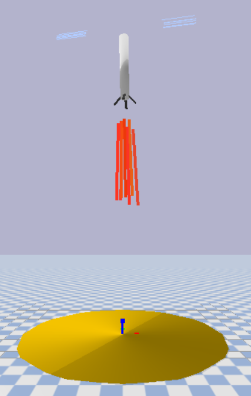
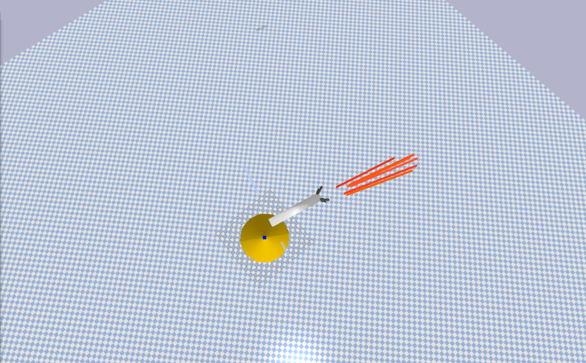

# Reinforcement learing rocket agent using Policy Based Networks

## Conetext:

This project is actualy were we wanted to try and land a rocket using 
reinforcement learing model . 
We built our own custom rl evnironemt using pybullet and we used stable baseline 3
for the model and training that model in our custom environment .

## Demo:

|

### Prequisites:
* Python 
* Visual studios (not vs code),for installing c++ development kit 
* Install libraies in requirements.txt

### How to run this project in your device:
1. First git clone the repo :
     git clone https://github.com/shahansshetty/RL_using_ppo.git
2. Create your environment :
    python -m  venv venv
    venv\Scripts\activate
3. Now install requirements.txt :
    pip install -r requirements.txt
4. Now to test the simulation , run :
    python test_environment.py
5. To run the per-trained model run :
    python test.py
    

### Environemt:
* Custom env using gynasium and pybullet
* Using rocket.urdf as rocket model and using landing.urdf for the model of the landing pad

## Neural Network Model

* Using stable baselines 3 for neural netowrk
* Stable baselines is libary which is used for reliable implementaion of
  reinforcement learning algorithms .
* Also supports tensorboard which is used to monitor the performance of the RL algorithm.
* Using ppo (proximal policy optimization) Rl algorithm
* Also using VecNormalization because we are training the model in multiple parllel environemnts (16 in total) during training.

(Readme file still unfinished ...... )
