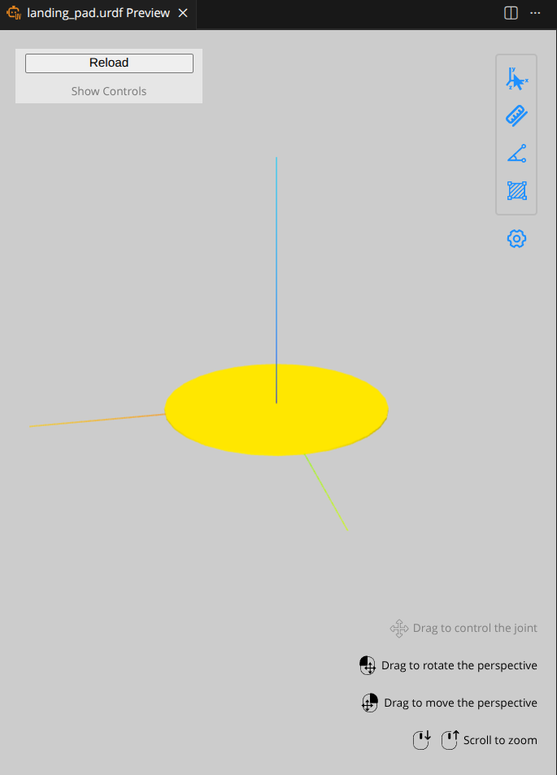
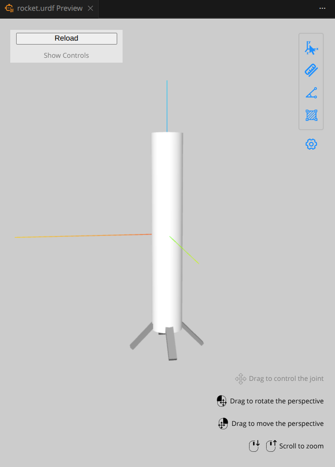

# Reinforcement learing rocket agent using Policy Based Networks

## Context:

This project is actualy were we wanted to try and land a rocket using 
reinforcement learing model . 
We built our own custom rl evnironemt using pybullet and we used stable baseline 3
for the model and training that model in our custom environment .

## Demo:

## Prequisites:
* Python   
* PyBullet
* Stable_Baselines3
* Visual studios (not vs code),for installing c++ development kit in windows
* Install libraies in requirements.txt

## How to run this project in your device:

### Without training your own model:

1. First git clone the repo:
     git clone https://github.com/shahansshetty/RL_using_ppo.git
2. Create your environment:
    python -m  venv venv
    venv\Scripts\activate
3. Now install requirements.txt:
    pip install -r requirements.txt
4. Now to test the simulation , run:
    python test_environment.py
5. To run the pre-trained model run:
    python test.py

### With training your own model:

1. First git clone the repo :
     git clone https://github.com/shahansshetty/RL_using_ppo.git
2. Create your environment :
    python -m  venv venv
    venv\Scripts\activate
3. Now install requirements.txt :
    pip install -r requirements.txt
4. Now to test the simulation , run :
    python test_environment.py
5. Now run train.py to train your own model :
    * You can change the number of total_timesteps used for training:
        total_timesteps=10000000 #any number you think is enough .
    * You can also change the name of the final_model_path and final_vecnorm_path as you like . 
    * Now run the python program in terminal:
        python train.py
6. After you train your model go to the test.py and change the model_path and vecnorm_path to your trained model paths and vecnorm_path

## Environemt:
* Custom env using gynasium and pybullet
* Using rocket.urdf as rocket model and using landing.urdf for the model of the landing pad

landing pad urdf :

rocket urdf :

## Neural Network Model:

* Using stable baselines 3 for neural netowrk
* Stable baselines is libary which is used for reliable implementaion of
  reinforcement learning algorithms .
* Also supports tensorboard which is used to monitor the performance of the RL algorithm.
* Using ppo (proximal policy optimization) Rl algorithm
* Also using VecNormalization because we are training the model in multiple parllel environemnts (16 in total) during training.

